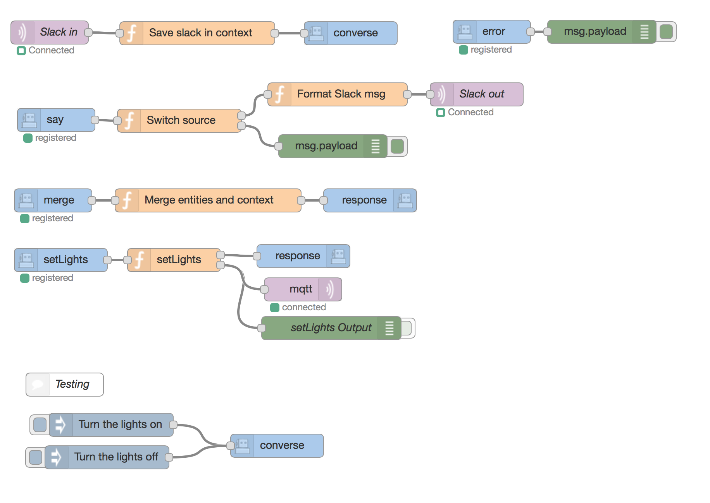

node-red-contrib-wit-ai
==============================

<a href="http://nodered.org" target="_new">Node-RED</a> nodes to integrate with <a href="http://wit.ai" target="_new">Wit.ai</a>.

Install
-------

Run the following command in your Node-RED user directory - typically `~/.node-red`

        npm install node-red-contrib-wit-ai

Make sure you have an account and an app at https://wit.ai/. You will need the `Server Access Token` that can be found in the Settings menu of your Wit.ai app.

Wit.ai API conformance
----------------------

20160330

https://wit.ai/docs/http/20160330

Usage
-----

Provides these nodes:

Note: One each of __Merge__, __Say__ and __Error__ are required to be in the flow. Also, one __Action__ node for each defined action is required.

### Wit Message

Takes a sentence and returns the meaning.

Expects the `payload` to be a `String`.

Uses wit.ai's `/message` endpoint.

Does not yet support the `context`, `msg_id`, `thread_id`, and `n` parameters.

### Wit Converse

This is the node where you send a question or statement to your Wit.ai bot. Typically you would hook this up to a messaging app like Slack or Facebook Messanger.

You can provide a `sessionId` and a `context` along with the `payload`. If not, they will be created for you.

After the __Converse__ node has been given a message, the __Merge__, __Action__ and __Say__ nodes will trigger.

### Wit Merge

For each configured Wit.ai bot you must provide one single __Merge__ node. After a message has been sent to the bots __Converse__ node, the __Merge__ node will trigger and send a message with a `context` and `entities`.

Attach a __Function__ node to the merge node and modify the provided `context` depending on the recieved `entities`.

The __Function__ node must then send the message along to a __Response__ node configured for the same Wit.ai bot as the __Merge__ node where the message originated.

Its best if you keep the same `msg` object through your flow, so to not loose any meta information stored by the Wit.ai bot.

### Wit Action

If you have configured an action in any of your Wit.ai stories, you need to create an __Action__ node in your flow with the same action name.

This node will be triggered if the conversation identifies this action.

Like the __Merge__ node, you should let the message from an __Action__ node continue to a __Response__ node. Modify the `msg` object, but don't replace it.

You can only have one __Action__ node for each action on a bot.

### Wit Response

A __Response__ node takes the message from a __Merge__ or __Action__ node and makes sure the conversation continues.

### Wit Say

The __Say__ node is triggered when the bot has something to say. Typically you would forward the `payload` to a messaging system like Slack or Facebook Messanger.

### Wit Error

The __Error__ node outputs any errors that was enconuntered during the conversation. This could be forwarded to a messaging system.

### Sample Flow

    [{"id":"b96f8db7.46907","type":"mqtt-broker","z":"","broker":"mybroker.com","port":"1883","clientid":"","usetls":false,"verifyservercert":false,"compatmode":true,"keepalive":"15","cleansession":true,"willTopic":"","willQos":"0","willRetain":"true","willPayload":"","birthTopic":"","birthQos":"0","birthRetain":"true","birthPayload":""},{"id":"33013393.ccfecc","type":"wit-app","z":"a14acd95.5eb53","name":"My Wit App","token":"my-witt-app-token"},{"id":"bdde0b8.f4221f8","type":"slack-bot-controller","z":"","name":"My Slack Bot","token":"my-slack-bot-token"},{"id":"c4e09a4c.3b1f68","type":"slack-in","z":"a14acd95.5eb53","name":"Slack in","events":"direct_mention,direct_message","controller":"bdde0b8.f4221f8","x":223,"y":135,"wires":[["62b96ee1.9d469"]]},{"id":"4355ed9b.bcaa14","type":"wit-converse","z":"a14acd95.5eb53","name":"","app":"33013393.ccfecc","x":611.5,"y":136,"wires":[]},{"id":"d9fa59ab.2605a8","type":"wit-merge","z":"a14acd95.5eb53","name":"","app":"33013393.ccfecc","x":227.5,"y":352,"wires":[["200549fb.dffab6"]]},{"id":"200549fb.dffab6","type":"function","z":"a14acd95.5eb53","name":"Merge entities and context","func":"const firstEntityValue = (entities, entity) => {\n  const val = entities && entities[entity] &&\n    Array.isArray(entities[entity]) &&\n    entities[entity].length > 0 &&\n    entities[entity][0].value\n  ;\n  if (!val) {\n    return null;\n  }\n  return typeof val === 'object' ? val.value : val;\n};\n\nconst intent = firstEntityValue(msg.entities, 'intent');\nif(intent) msg.context.intent = intent;\nconst on_off = firstEntityValue(msg.entities, 'on_off');\nif(on_off) msg.context.on_off = on_off;\nconst light_description = firstEntityValue(msg.entities, 'light_description');\nif(light_description) msg.context.light_description = light_description;\n\nreturn msg;","outputs":1,"noerr":0,"x":427.5,"y":352,"wires":[["3059da01.cfa626"]]},{"id":"3059da01.cfa626","type":"wit-response","z":"a14acd95.5eb53","name":"","app":"33013393.ccfecc","x":636.5,"y":352,"wires":[]},{"id":"f0b9c456.0f4638","type":"wit-action","z":"a14acd95.5eb53","name":"","app":"33013393.ccfecc","action":"setLights","x":237.5,"y":429,"wires":[["1b501a10.e4afe6"]]},{"id":"cbc9490c.3436b8","type":"wit-say","z":"a14acd95.5eb53","name":"","app":"33013393.ccfecc","x":231.5,"y":248,"wires":[["ceb4d1a6.314b3"]]},{"id":"1c486d28.e3b793","type":"slack-out","z":"a14acd95.5eb53","name":"Slack out","channel":"","controller":"bdde0b8.f4221f8","x":774,"y":215,"wires":[]},{"id":"5cac2acf.a353d4","type":"wit-error","z":"a14acd95.5eb53","name":"","app":"33013393.ccfecc","x":793.5,"y":134,"wires":[["76ff9602.890068"]]},{"id":"76ff9602.890068","type":"debug","z":"a14acd95.5eb53","name":"","active":true,"console":"false","complete":"false","x":935.5,"y":134,"wires":[]},{"id":"59324657.a6cdb8","type":"wit-response","z":"a14acd95.5eb53","name":"","app":"33013393.ccfecc","x":550.5,"y":424,"wires":[]},{"id":"62b96ee1.9d469","type":"function","z":"a14acd95.5eb53","name":"Save slack in context","func":"return {\n    context: {\n        source: {\n            'type': 'slack',\n            msg: msg\n        }\n    },\n    payload: msg.payload\n};","outputs":1,"noerr":0,"x":413.5,"y":136,"wires":[["4355ed9b.bcaa14"]]},{"id":"edfce749.120318","type":"function","z":"a14acd95.5eb53","name":"Format Slack msg","func":"const slackProp = (msg, prop) => {\n    const val = msg && \n        msg['context'] && \n        msg['context']['source'] && \n        msg['context']['source']['msg'] &&\n        msg['context']['source']['msg'][prop]\n    \n    if(!val) {\n        return null;\n    }\n    return val;\n}\n\nvar channel = slackProp(msg, 'channel');\nif(!channel) {\n    return;\n}\n\nreturn {\n    payload: msg.payload,\n    channel: channel\n};","outputs":1,"noerr":0,"x":594.5,"y":215,"wires":[["1c486d28.e3b793"]]},{"id":"546259d5.ab9da8","type":"mqtt out","z":"a14acd95.5eb53","name":"","topic":"","qos":"","retain":"","broker":"b96f8db7.46907","x":550,"y":467,"wires":[]},{"id":"1b501a10.e4afe6","type":"function","z":"a14acd95.5eb53","name":"setLights","func":"var context = msg.context;\n\nvar payload = null;\nif(context['light_description']){\n    payload = context['light_description'];\n} else if(context['on_off']) {\n    payload = context['on_off'];\n}\n\nif(payload) {\n    return [msg, {\n        topic: 'nodered-local/ledstrip',\n        payload: payload\n    }];\n}\n\n// TODO: can we tell Wit that we didnt understand the context?\nreturn [msg, null];\n","outputs":"2","noerr":0,"x":383.5,"y":429,"wires":[["59324657.a6cdb8"],["f6dafb0e.092508","546259d5.ab9da8"]]},{"id":"f6dafb0e.092508","type":"debug","z":"a14acd95.5eb53","name":"setLights Output","active":false,"console":"false","complete":"payload","x":586.5,"y":517,"wires":[]},{"id":"ceb4d1a6.314b3","type":"function","z":"a14acd95.5eb53","name":"Switch source","func":"const sourceType = msg['context'] && msg['context']['source'] && msg['context']['source']['type'];\nif(sourceType === 'slack') {\n    return [msg, null];\n}\n\nreturn [null, msg];","outputs":"2","noerr":0,"x":390.5,"y":249,"wires":[["edfce749.120318"],["74017b26.8bfe84"]]},{"id":"74017b26.8bfe84","type":"debug","z":"a14acd95.5eb53","name":"","active":true,"console":"false","complete":"false","x":588.5,"y":282,"wires":[]},{"id":"91829b99.6e7d68","type":"inject","z":"a14acd95.5eb53","name":"","topic":"","payload":"Turn the lights on","payloadType":"str","repeat":"","crontab":"","once":false,"x":302.5,"y":642,"wires":[["437854b3.bc87ac"]]},{"id":"437854b3.bc87ac","type":"wit-converse","z":"a14acd95.5eb53","name":"","app":"33013393.ccfecc","x":516.5,"y":669,"wires":[]},{"id":"400a5b5c.bff5a4","type":"inject","z":"a14acd95.5eb53","name":"","topic":"","payload":"Turn the lights off","payloadType":"str","repeat":"","crontab":"","once":false,"x":297,"y":684,"wires":[["437854b3.bc87ac"]]},{"id":"86bdb34a.79425","type":"comment","z":"a14acd95.5eb53","name":"Testing","info":"","x":242.5,"y":590,"wires":[]}]

